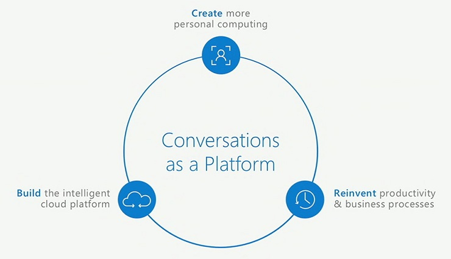
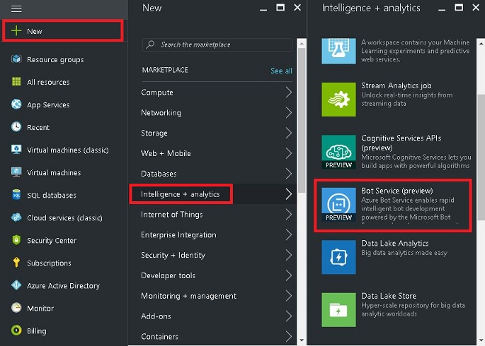
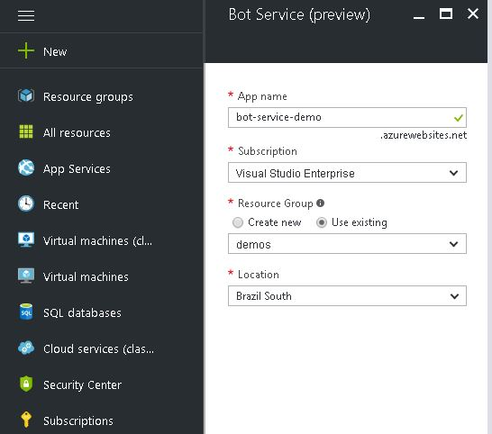
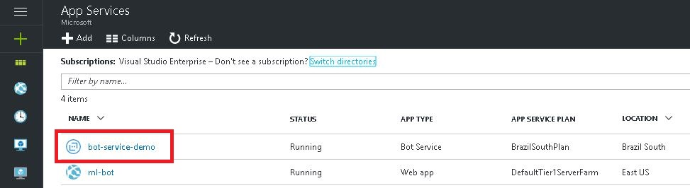

# Intelligent Bots with Azure Bot Service

## Introduction

Industry’s first cloud Bot-as-a-Service, Azure Bot Service is a platform that accelerates bot's development. 
It is an integrated environment that enables us to register, build, deploy and manage intelligent bots at once. 
In addition, you can easily integrate [Microsoft Cognitive Services](https://www.microsoft.com/cognitive-services) 
with bots to enhance user experience and interaction. 
The platform is powered by [Microsoft Bot Framework](https://docs.botframework.com/en-us/) and 
[Azure Functions](https://azure.microsoft.com/en-us/blog/introducing-azure-functions/).

 

## Azure Bot Service vs Bot Framework Developer Portal

If you are familiar with bot development using Microsoft Bot Framework you can be thinking about what are the diferences 
between features provided by Azure Bot Service and [Bot Framework Developer Portal](https://dev.botframework.com/).

Azure Bot Service is integrated with Azure environment and Microsoft Cognitive Services. 
It means that in a single platform you can create a messaging endpoint, build, deploy and manage your bots. 

On the other hand, Bot Framework Developer Portal doesn't have these integrations. 
You can integrate your bot with Azure and Microsoft Cognitive Services, but you need to do it by yourself. 
The advantage is that it lets you create bots without necessarily using the Azure platform. 
You can create the messaging endpoint using another cloud provider.

So depending on the scenario, you can implement your bot using Azure Bot Service or Bot Framework Developer Portal.

# Creating a new Azure Bot Service from Azure Portal

First of all, it is necessary to have an **Azure Subscription**. 
For more details, see [How to sign up, purchase, upgrade, or activate Azure](https://docs.microsoft.com/en-us/azure/billing-buy-sign-up-azure-subscription).

Open the [Azure Portal](https://portal.azure.com) and sign in with your account. Then click on **New [+]** > **Intelligence + analytics** > **Bot Service**.

 

Fill the required fields and then click on **Create**.

When you create a Bot Service, basically it is an Azure Web app with additional features. 
If you go to **App Services** section, you can see the Bot Service app and some detailed information.

Click on the Bot Service. Now you need to create a **Microsoft App ID** and a **Microsoft App Password**. 
To do this, click on **Create Microsoft App ID and password**. 

